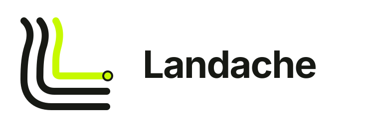

<picture>
  <source media="(prefers-color-scheme: dark)" srcset="assets/brand/logo-horizontal-on-dark.svg" />
  
</picture>

# Landache

An open-source coding agent built to be understandable, observable, and safe to extend.

Landache is in early development. The current vertical slice covers streamed model turns, a minimal
agent loop, OpenAI and DeepSeek Responses configurations, and a Rust-backed read-only file tool exposed through a thin
CLI.

[English documentation](docs/en/README.md) · [简体中文文档](docs/zh-CN/README.md)
