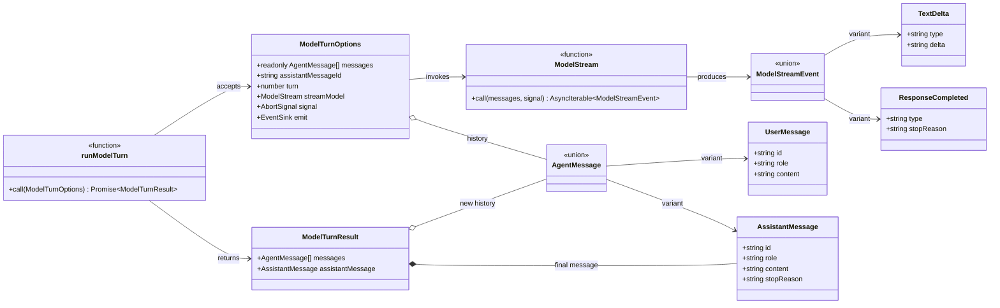

# Minimal Model Turn Design

[English](model-turn.md) | [简体中文](../../zh-CN/architecture/model-turn.md)

> Status: Implemented foundation  
> Target: V0.1  
> Last updated: 2026-10-02

## 1. Problem addressed by this change

Landache ultimately needs an agent loop that repeatedly calls a model, executes tools, and returns
tool results to the model. The first implementation covers only the smallest independently testable
unit of that loop: **one model turn**.

A model turn is responsible for:

1. accepting immutable message history;
2. starting one model stream;
3. translating text increments into structured events;
4. responding to cancellation and event-consumer failures;
5. producing a final assistant message only after explicit model completion.

It does not yet own tool calls, approval, retries, context compaction, persistence, or the decision to
start another turn. Those concerns belong to the future outer agent loop. Separating the layers lets
us stabilize the contracts between model streaming, messages, and events before adding complex
control flow.

## 2. Why it is named `runModelTurn`

The first prototype was named `runAgentLoop`, although it called the model only once and contained no
loop. Keeping that name would imply that tool results and multi-turn termination were already handled.

The current boundary is therefore named `runModelTurn`:

```text
future runAgentLoop
        │
        ├── runModelTurn
        ├── execute and record tool calls
        ├── append tool results to message history
        └── continue or stop according to explicit conditions
```

The caller supplies `turn` instead of the function hard-coding it. A future session restore or
continuation after tool execution can therefore maintain a correct, monotonically increasing turn
number.

## 3. Message data design

### 3.1 Every message has a stable ID

```ts
type UserMessage = {
  id: string
  role: "user"
  content: string
}

type AssistantMessage = {
  id: string
  role: "assistant"
  content: string
  stopReason: "end_turn"
}
```

The caller creates IDs because it will eventually own sessions, persistence, and idempotency. A stable
ID lets streaming deltas, the final message, UI projections, and database records refer to the same
logical object without relying on array positions or content comparison.

### 3.2 Input history is read-only

`messages` is a `readonly AgentMessage[]`. `runModelTurn` does not mutate caller-owned history; after
success, it returns a new array containing the final assistant message. This prevents partial failures
from silently contaminating session state and makes unit tests and future event persistence easier to
reason about.

### 3.3 Only complete assistant messages are valid

`AssistantMessage.stopReason` does not include `null`. During streaming, an internal `chunks` array and
an unresolved `stopReason` represent the draft. An assistant message is constructed only after
`response.completed` arrives.

The final message still owns `stopReason` because it records why the model stopped and will become an
input to the outer loop's decision to stop, execute tools, or continue. Only `end_turn` exists today;
tool calls, length limits, and other explicit variants can be added later.

### 3.4 `runModelTurn` type relationships



`signal` and `emit` are optional TypeScript fields; the diagram omits repeated `undefined` markers to
remain readable. `EventSink` represents `(event: AgentEvent) => void | Promise<void>`. The central
constraint is that `ModelStreamEvent` is only the stream input protocol. The function creates and
returns an `AssistantMessage` only after `ResponseCompleted` arrives.

## 4. Streaming event design

The current events are:

| Event | Minimal data | Reason |
| --- | --- | --- |
| `turn.started` | `turn` | Marks the start of one model turn |
| `message.started` | `messageId`, `role` | Lets consumers create an empty message projection |
| `message.delta` | `messageId`, `delta` | Sends only new content rather than the full message |
| `message.completed` | final `message` | Publishes the validated complete message |
| `turn.completed` | `turn`, `messageId` | Ends the turn and links its final message |

`message.delta` does not carry an ever-growing message snapshot. Consumers accumulate deltas by
`messageId`; internally, the server stores chunks and calls `join("")` only once at completion. This
prevents transmitted data from growing repeatedly with the response.

This layer no longer emits `agent.started` or `agent.completed`. A single model turn cannot truthfully
declare that the entire agent run has started or finished; those events belong to the future real agent
loop.

## 5. Explicit model-stream handling

Model stream events form a discriminated union and are handled individually with a `switch`:

```ts
type ModelStreamEvent =
  | { type: "text.delta"; delta: string }
  | { type: "response.completed"; stopReason: "end_turn" }
```

The default branch calls `assertNever`. When tool-call, usage, or reasoning events are added, TypeScript
will fail the build if their handling is omitted instead of silently treating a new event as completion.

If the stream ends before `response.completed`, the function throws and does not produce an apparently
complete assistant message.

## 6. Cancellation and event-consumer semantics

The `AbortSignal` is checked before model startup and while consuming every stream event:

- a pre-start cancellation prevents the model from being called;
- a mid-stream cancellation fails the turn without publishing a completed message;
- the same signal is passed to the provider adapter so it can eventually cancel the network request.

`emit` is an awaited, fail-fast boundary. If an event consumer throws, the model turn fails immediately.
This matters because a future persistence layer may itself consume events; continuing would create a
state where the model advanced but a critical fact was not stored. A later event-bus design can decide
whether durable consumers and best-effort UI subscribers require separate semantics.

## 7. Why build and type checking belong to this design

Node.js TypeScript type stripping removes type syntax but does not prove type correctness. Therefore:

- `node --test` is responsible only for executing tests;
- every TypeScript package has its own build and type-check scripts;
- the root `tsconfig.json` uses Project References to express the `agent -> protocol` dependency;
- packages export JavaScript and declarations from `dist/`, not public `src/*.ts` entry points;
- pull-request CI runs type checking, building, and tests.

Tests are checked by a separate `tsconfig.test.json`. A test suite that executes successfully while
containing type errors can no longer reach the main branch.

## 8. How Pi informed the design

This design studied
[`packages/agent/src/agent-loop.ts`](https://github.com/earendil-works/pi/blob/de7e675de2c909776a2ed6253fe6b8495465167b/packages/agent/src/agent-loop.ts)
from Pi at commit `de7e675de2c909776a2ed6253fe6b8495465167b`.

The structural ideas adopted from Pi are:

- expose model output incrementally through events instead of waiting for a complete string;
- keep model turns, tool execution, and outer continuation conditions as separate layers;
- propagate an `AbortSignal` through model and tool paths;
- make tool results messages in subsequent model turns;
- expose observable lifecycle events for significant stages.

Landache did not copy Pi implementation code or immediately adopt its mature features, including
steering, follow-up queues, parallel or sequential tool execution, dynamic tool sets, context
transformation, and recovery of truncated tool calls. Those features depend on a fuller data model and
demonstrated requirements. Copying them early would hide architectural decisions Landache has not made.

## 9. Foundation for the next steps

The stable seams established by this change support:

1. extending assistant messages with structured tool calls;
2. defining a tool registry, argument schemas, and normalized tool results;
3. implementing an outer `runAgentLoop` that alternates model turns and tool execution;
4. deciding explicitly whether to continue from `stopReason` and tool calls;
5. connecting events to persistence and CLI/Web projections;
6. mapping different model SDKs into `ModelStreamEvent` in provider adapters;
7. adding sequence, run ID, timestamps, and schema versions after the event schema stabilizes.

The most useful next increment is **one minimal tool-call turn**, not UI, database integration, or a
complex provider. It will validate the real closed loop: model proposal → validation and execution →
recorded result → another model turn → explicit completion.
