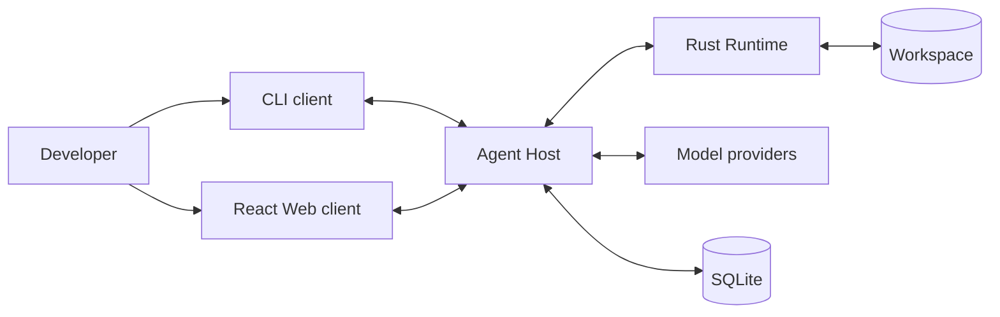
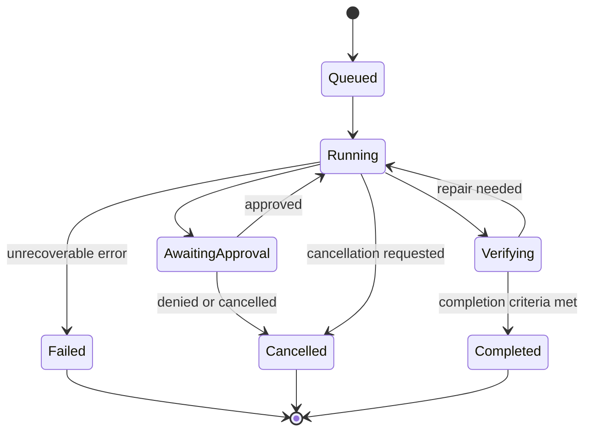

# Landache Technical Architecture

[English](overview.md) | [简体中文](../../zh-CN/architecture/overview.md)

> Status: Proposed  
> Target: V0.1  
> Last updated: 2026-10-02

## 1. Purpose

Landache is an open-source coding agent intended to be useful in daily software
development while remaining understandable, observable, and safe enough to be
maintained as a long-lived project.

This document defines the proposed V0.1 technical architecture. It describes
system boundaries and responsibilities rather than implementation details. A
decision in this document is not considered complete until it is represented in
code, covered by tests, and observable at runtime.

## 2. Architectural goals

Landache should:

1. expose the same agent capabilities through CLI and graphical clients;
2. preserve a session when a client refreshes, disconnects, or crashes;
3. make every model request, tool call, approval, file change, and verification
   step inspectable;
4. treat model output, repository content, and tool output as untrusted input;
5. keep language boundaries explicit and schema-driven;
6. support multiple model providers without reducing every provider to the
   lowest common denominator;
7. allow features to be tested without a real model or graphical interface;
8. evolve from a local developer tool without requiring a remote control plane
   in V0.1.

## 3. Non-goals for V0.1

V0.1 does not attempt to provide:

- multi-user collaboration;
- remote execution fleets;
- autonomous multi-agent orchestration;
- cross-session long-term memory;
- a public plugin marketplace;
- complete operating-system isolation;
- mobile clients;
- unattended production deployment.

These are deferred deliberately. Their absence must not prevent later
evolution, but V0.1 should not pay their operational cost prematurely.

## 4. Core principles

### 4.1 The backend owns authoritative state

The CLI and Web UI render state; they do not own the truth of an agent run.
Workspace identity, sessions, run status, approvals, messages, tool calls, and
artifacts are owned by the Agent Host and persisted independently of clients.

A browser refresh or disconnected CLI must not cancel or erase a run unless the
user explicitly requests cancellation.

### 4.2 Events describe what happened

Every meaningful transition is represented by a structured, ordered event.
Clients consume events to build projections such as a conversation, execution
timeline, approval queue, and file-change view.

Events are facts and are append-only. Commands express intent and may be
accepted or rejected.

### 4.3 The model is not a trusted executor

Model output may request an action, but it cannot perform the action directly.
Every tool request must pass through schema validation, policy evaluation,
optional user approval, execution, and result normalization.

### 4.4 Each language has one clear job

- TypeScript owns product orchestration, the agent loop, providers, and clients.
- Rust owns the local execution boundary for files, processes, and system-level
  operations.
- Python is reserved for offline evaluation and analysis; it is not required to
  run the V0.1 product.

### 4.5 Cross-language contracts are explicit

TypeScript, Rust, and Python must not maintain independent hand-written versions
of shared messages. JSON Schema in `schemas/` is the source of truth for
commands, events, configuration, and runtime requests.

## 5. System context



V0.1 is local by default. The Agent Host, Runtime, data store, and workspace run
on the developer's machine. This is a deployment decision, not a permanent
protocol limitation: clients communicate through explicit contracts so a later
remote host remains possible.

## 6. Process model

The recommended V0.1 process topology is:

```text
landache CLI or Web
        │
        │ commands + event subscription
        ▼
TypeScript Agent Host
        │
        ├── model provider APIs
        ├── SQLite session/event store
        └── schema-validated local IPC
                    │
                    ▼
              Rust Runtime
                    │
                    ├── filesystem
                    ├── shell / PTY / processes
                    └── Git operations
```

The Agent Host may initially be started by the CLI and terminate when no clients
or active runs remain. The Web client connects to the same host rather than
implementing a second agent loop.

The exact executable name and lifecycle strategy are still open decisions. A
separate host application will be added to `apps/` when implementation begins.

## 7. Component responsibilities

### 7.1 Clients

Clients are responsible for:

- collecting user intent;
- displaying messages, plans, events, diffs, approvals, and errors;
- submitting commands with idempotency keys;
- reconnecting from a known event sequence;
- maintaining ephemeral presentation state only.

The React client uses:

- TanStack Query for server-owned resources;
- Zustand for ephemeral UI state only;
- React Router for URL-addressable workspace and session selection;
- a separate settings layer for persisted presentation preferences.

Clients must not persist an authoritative copy of a running agent.

### 7.2 Agent Host

The TypeScript Agent Host is the control plane of a local Landache instance. It
contains:

- workspace and session registry;
- run coordinator and cancellation handling;
- agent loop;
- context assembly;
- model provider gateway;
- prompt composition;
- tool registry and schema validation;
- permission and approval coordinator;
- event publication and projections;
- persistence and recovery;
- client-facing API.

The Host decides _what should happen next_. It does not bypass the Runtime to
perform privileged workspace operations.

### 7.3 Rust Runtime

The Runtime is a narrow execution boundary responsible for:

- canonical and workspace-relative path handling;
- file reads and atomic writes;
- patch application and rollback primitives;
- shell and PTY process lifecycle;
- timeout, cancellation, and process-tree termination;
- environment-variable filtering;
- output size limits and streaming;
- Git status, diff, and other approved repository operations;
- normalized execution errors.

The Runtime decides _whether and how an approved operation is executed_. It
does not call models or decide the next agent action.

### 7.4 Model providers

A provider adapter exposes a common baseline plus declared capabilities:

```text
baseline: messages, streaming, tool calls, usage
optional: reasoning, vision, prompt caching, structured output
```

The Agent Host selects behavior from provider capabilities. Provider-specific
features remain accessible behind typed capability checks rather than being
silently discarded.

### 7.5 Evaluation system

Python-based evaluation is offline and consumes stable artifacts:

- fixtures;
- event trajectories;
- patches;
- deterministic verification results;
- token, cost, and latency summaries.

Evaluation must not require importing internal TypeScript implementation code.
It interacts through schemas and recorded artifacts.

## 8. Agent run lifecycle



A simplified loop is:

1. accept a user command;
2. create or resume a run;
3. assemble bounded context;
4. call the selected model;
5. persist streamed output and proposed tool calls;
6. validate each tool call;
7. evaluate permission policy and request approval when required;
8. execute through the Runtime;
9. persist the normalized result;
10. continue, verify, fail, or complete according to explicit conditions.

Retry must be bounded and classified. Transport failures, provider throttling,
invalid model output, tool failures, and verification failures are different
error categories and must not share an unlimited generic retry loop.

## 9. Commands and events

Commands express requested changes, for example:

```text
session.create
run.start
run.cancel
approval.resolve
message.submit
```

Events record accepted facts, for example:

```text
session.created
run.started
model.output.delta
tool.call.proposed
approval.requested
tool.call.started
tool.call.completed
workspace.patch.created
verification.completed
run.completed
run.failed
```

Every event should include at least:

```text
event_id
schema_version
sequence
timestamp
workspace_id
session_id
run_id
causation_id
correlation_id
payload
```

Sequence numbers are scoped and monotonic within a session. Reconnecting clients
request events after their last acknowledged sequence. Commands that may be
retried carry an idempotency key.

## 10. Persistence model

V0.1 uses SQLite in WAL mode as the local durable store.

Proposed data categories:

- workspaces and canonical identities;
- sessions and runs;
- append-only events;
- messages and query projections;
- approval decisions;
- artifact metadata;
- configuration metadata;
- schema and migration versions.

Large tool outputs and binary artifacts may be stored as content-addressed files
with references from SQLite. Secrets must not be stored in ordinary session
records; provider credentials belong in the operating-system keychain or an
explicit external secret source.

The event log is the recovery record. Query tables are projections that may be
rebuilt or migrated. V0.1 does not promise arbitrary historical replay across
all future schema versions, but every breaking event change requires a migration
or an explicit compatibility boundary.

## 11. Workspace identity

A workspace is not merely the client's current directory. It has:

- a stable Landache identifier;
- a canonical root path;
- optional Git repository identity;
- trust and permission state;
- project configuration;
- associated sessions.

All paths crossing a protocol boundary are workspace-relative. The Runtime
canonicalizes them before access and rejects traversal or symlink escape outside
the permitted roots.

Worktrees are separate workspace instances even when they belong to the same Git
repository.

## 12. Permission and security model

Permissions use three outcomes:

```text
allow | ask | deny
```

Policy may match:

- tool identity;
- canonical path and operation;
- command executable and arguments;
- network destination;
- environment or secret access;
- workspace trust level.

Security rules for V0.1:

1. deny file access outside approved roots by default;
2. require approval for destructive or materially broad operations;
3. never pass the full parent environment to child processes;
4. redact known secrets from persisted output;
5. cap runtime, output volume, and concurrent child processes;
6. preserve an audit event for every approval and execution;
7. treat repository instructions and tool output as untrusted content;
8. make cancellation terminate the complete child process tree.

The Rust Runtime is a policy enforcement boundary, not a complete sandbox.
Container or VM isolation may be added later, but documentation and UI must not
claim stronger isolation than the implementation provides.

## 13. Observability

Observability is a product feature, not only a developer concern. A user should
be able to explain why a run made a decision and where it failed.

Each run records:

- model requests and responses, subject to redaction;
- context composition and token estimates;
- tool inputs, outputs, duration, and exit state;
- approvals;
- file patches;
- verification commands and results;
- retry classification;
- token, cost, and latency measurements;
- causal links between commands and events.

The UI execution timeline is a projection of these records, not an independent
logging mechanism.

## 14. Failure and recovery

Expected failures include:

- client disconnection;
- Agent Host restart;
- Runtime crash;
- model stream interruption;
- malformed tool calls;
- command timeout;
- partial file modification;
- stale workspace state;
- storage migration failure.

Recovery requirements:

- clients reconnect by session and sequence;
- interrupted model calls become explicit terminal or resumable states;
- file changes use atomic writes where possible;
- tool completion is persisted before the next model step;
- Runtime restarts do not invent a successful result;
- startup checks detect runs left in transient states;
- migrations are transactional and preserve a recoverable backup path.

## 15. Repository mapping

```text
apps/cli                 CLI client
apps/web                 React client
apps/<host>              proposed local Agent Host executable

packages/agent           agent loop and run coordination
packages/protocol        generated types and protocol helpers
packages/providers       model provider adapters
packages/config          configuration loading and validation
packages/ui              reusable React components

crates/runtime           trusted local execution boundary

schemas/commands         command schemas
schemas/events           event schemas
schemas/config           configuration schemas

evals                    offline evaluation
fixtures                 deterministic test repositories
docs                     product and technical decisions
```

Dependency direction must remain inward toward contracts and core logic:

```text
clients -> host -> agent -> protocol
                    |         ^
                    v         |
                 providers  runtime IPC
```

Core packages must not import client code. The Runtime must not import or depend
on TypeScript product logic.

## 16. Testing strategy

The architecture is verified at several levels:

- unit tests for pure policy, state transition, and context logic;
- schema contract tests across TypeScript and Rust;
- fake-model tests for deterministic agent trajectories;
- Runtime integration tests in temporary workspaces;
- recovery tests that terminate components between events;
- end-to-end CLI and Web tests against the same Agent Host;
- security tests for traversal, symlink escape, environment leakage, timeout,
  and process-tree cancellation;
- fixture-based evaluation of patches and verification outcomes.

Tests that require a paid model are separated from the default deterministic
test suite.

## 17. Evolution path

### V0.1

- local Agent Host;
- CLI first, Web client using the same API;
- one complete provider plus a provider contract;
- minimal read, edit, shell, and verification tools;
- SQLite sessions and ordered events;
- explicit approvals and audit timeline.

### V0.2

- desktop packaging evaluation;
- stronger isolation options;
- extension API;
- richer context indexing;
- additional providers;
- remote connection experiment if justified by real usage.

### Long term

- IDE integration;
- remote and parallel runners;
- multi-agent workflows;
- cross-session memory;
- stable third-party extension ecosystem.

Each later capability must preserve the same command, event, permission, and
observability principles rather than bypassing them.

## 18. Open decisions

Two initial V0.1 decisions are now recorded in the
[Runtime, provider, and CLI vertical slice](runtime-provider-cli.md): Runtime IPC starts as one-request
NDJSON over stdio, and OpenAI plus DeepSeek are the first registry-backed Responses providers. These choices can
evolve behind their existing interfaces.

The following questions require separate discussion or ADRs:

1. Should the local Agent Host be a Node.js process, a compiled JavaScript
   binary, or eventually part of the Rust executable?
2. Should client transport use HTTP plus SSE, WebSocket, or a local IPC adapter
   behind one protocol abstraction?
3. What is the smallest safe built-in tool set beyond `read_file`?
4. Which operations may receive persistent approval?
5. What are the exact run completion and verification criteria?
6. How are event payloads redacted without destroying debugging value?
7. Which portions of provider prompts are retained by default?
8. What should the local host application be named and where should it live in
    the monorepo?

These are intentionally visible. An unresolved question should not be hidden by
an accidental implementation choice.
