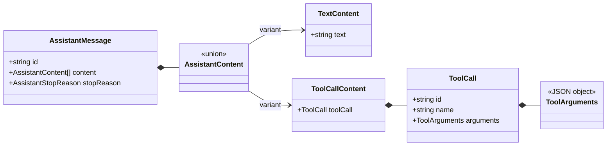

# Tool Call Data Contract

[English](tool-call-contract.md) | [简体中文](../../zh-CN/architecture/tool-call-contract.md)

> Status: Implemented data contract  
> Target: V0.1  
> Last updated: 2026-10-02

## 1. Scope of this change

This change only lets a model propose structured tool calls and stores them in the final assistant
message. It does not register tools, validate tool-specific arguments, execute a tool, or produce a
tool result. This keeps the model-output protocol separate from the side-effecting execution system.

## 2. Core types

### Content is an array

Assistant message `content` changes from a string to a discriminated array of content blocks. It can
preserve the model's actual order, such as “explanation → tool call → more text,” and provides explicit
extension points for reasoning or image content later.

### Arguments must be serializable

`ToolArguments` is a JSON object rather than `unknown`. Tool calls will eventually cross events,
databases, logs, and process boundaries; non-serializable values cannot be part of that protocol. A
future tool registry remains responsible for validating each tool's specific argument schema.

### IDs and names serve different purposes

`name` locates the tool in a registry. `id` identifies this invocation so a future tool result can
refer to it exactly. Tool-call IDs must be unique within one assistant message; duplicate IDs make
result correlation ambiguous and are rejected by the current turn.

## 3. Stream and completion semantics

A provider adapter assembles provider-specific argument fragments before sending
`tool_call.completed` to the core. The core then emits `tool.call.proposed`; “proposed” makes clear that
schema validation, permission checks, and execution have not happened yet.

`runModelTurn` enforces these invariants:

- `tool_use` requires at least one tool call;
- a response containing a tool call cannot finish with `end_turn`;
- one message cannot contain duplicate tool-call IDs;
- the stream must finish explicitly with `response.completed`.

Invariant failures occur after lifecycle start events, so they close with `message.failed` and
`turn.failed`. Aborts use separate cancelled events, allowing projections and audit trails to distinguish
failure from user cancellation.

The model stream owns an independent `ModelStopReason`, which is mapped explicitly to the message's
`AssistantStopReason`. In addition to `end_turn` and `tool_use`, `max_tokens` and `content_filter` are
preserved without losing provider stop semantics.

## 4. Why arguments are not exposed incrementally yet

Tool-call delta formats differ significantly between providers, and partial JSON has no stable meaning
for the core, UI, or executor. At this stage, adapters own assembly and the core accepts complete calls.
If the UI later needs to show argument generation, an observational delta event can be added without
allowing incomplete arguments into the executable contract.

## 5. Foundation for the next step

The next increment can add tool definitions, a registry, schema validation, and a tool-result message.
A real `runAgentLoop` can then respond to `tool_use`, execute calls, append results, and start another
model turn.
