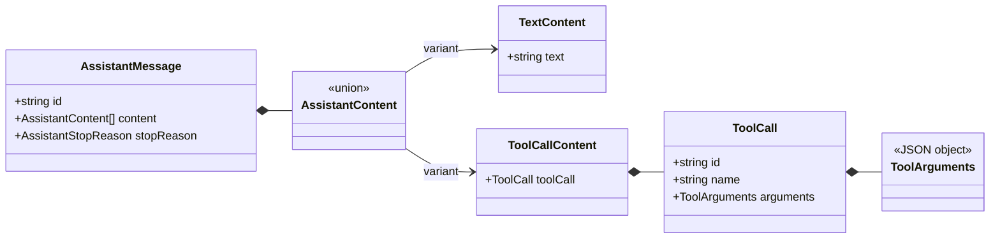

# Tool Call Data Contract

[English](tool-call-contract.md) | [简体中文](../../zh-CN/architecture/tool-call-contract.md)

> Status: Implemented data contract  
> Target: V0.1  
> Last updated: 2026-10-02

## 1. Scope of this change

This change only lets a model propose structured tool calls and stores them in the final assistant
message. It does not register tools, validate tool-specific arguments, execute a tool, or produce a
tool result. This keeps the model-output protocol separate from the side-effecting execution system.

## 2. Core types



### Content is an array

Assistant message `content` changes from a string to a discriminated array of content blocks. It can
preserve the model's actual order, such as “explanation → tool call → more text,” and provides explicit
extension points for reasoning or image content later.

### Arguments must be serializable

`ToolArguments` is a JSON object rather than `unknown`. Tool calls will eventually cross events,
databases, logs, and process boundaries; non-serializable values cannot be part of that protocol. A
future tool registry remains responsible for validating each tool's specific argument schema.

### IDs and names serve different purposes

`name` locates the tool in a registry. `id` identifies this invocation so a future tool result can
refer to it exactly. Tool-call IDs must be unique within one assistant message; duplicate IDs make
result correlation ambiguous and are rejected by the current turn.

## 3. Content block assembly

`runModelTurn` does not treat each delta as a finished block. It assembles the ordered `content` array
from the stream. Text arrives incrementally as `text.delta`, while complete tool calls arrive as
`tool_call.completed`. Two pieces of draft state bridge the gap:

```ts
const content: AssistantContent[] = []   // finished blocks, in model order
const pendingTextChunks: string[] = []   // unflushed text deltas
```

Text deltas accumulate in `pendingTextChunks` and are never pushed straight into `content`. The buffer
is flushed at exactly two boundaries:

1. when a tool call arrives, before its tool-call block is appended;
2. after the stream ends, to close the final text run.

Flushing joins the accumulated deltas into a single `text` block and clears the buffer. This produces
one text block per contiguous run of text, preserves text/tool-call order, and never emits an empty
text block.

### Worked example

A turn that reads a file, checks a test baseline with two consecutive commands, and then edits a file
receives this stream:

```text
text.delta          "I'll read"                  (1)
text.delta          " the README"                (2)
tool_call.completed read_file        (c1)        (3)
text.delta          "Found a typo, checking"     (4)
text.delta          " the baseline"              (5)
tool_call.completed run_command      (c2)        (6)
tool_call.completed run_command      (c3)        (7)
text.delta          "Baseline is clean, now"     (8)
text.delta          " editing"                   (9)
tool_call.completed edit_file        (c4)        (10)
text.delta          "Done"                       (11)
response.completed  (tool_use)                   (12)
```

| Step | Event | `pendingTextChunks` | `content` |
| --- | --- | --- | --- |
| 1 | `text.delta "I'll read"` | `["I'll read"]` | `[]` |
| 2 | `text.delta " the README"` | `["I'll read", " the README"]` | `[]` |
| 3 | `tool_call.completed` c1 | flush → `[]` | `[text "I'll read the README", tool c1]` |
| 4 | `text.delta "Found a typo, checking"` | `["Found a typo, checking"]` | unchanged |
| 5 | `text.delta " the baseline"` | `["Found a typo, checking", " the baseline"]` | unchanged |
| 6 | `tool_call.completed` c2 | flush → `[]` | `[text, tool c1, text "Found a typo, checking the baseline", tool c2]` |
| 7 | `tool_call.completed` c3 | flush → `[]` (no-op) | `[text, tool c1, text, tool c2, tool c3]` |
| 8 | `text.delta "Baseline is clean, now"` | `["Baseline is clean, now"]` | unchanged |
| 9 | `text.delta " editing"` | `["Baseline is clean, now", " editing"]` | unchanged |
| 10 | `tool_call.completed` c4 | flush → `[]` | `[text, tool c1, text, tool c2, tool c3, text "Baseline is clean, now editing", tool c4]` |
| 11 | `text.delta "Done"` | `["Done"]` | unchanged |
| 12 | `response.completed` | unchanged | unchanged |
| end | final flush | → `[]` | `[..., text "Done"]` |

The final `content` is:

```ts
content = [
  { type: "text",      text: "I'll read the README" },
  { type: "tool_call", toolCall: c1 },   // read_file
  { type: "text",      text: "Found a typo, checking the baseline" },
  { type: "tool_call", toolCall: c2 },   // run_command
  { type: "tool_call", toolCall: c3 },   // run_command
  { type: "text",      text: "Baseline is clean, now editing" },
  { type: "tool_call", toolCall: c4 },   // edit_file
  { type: "text",      text: "Done" },
]
```

Two details are easy to get wrong and worth calling out:

- Steps 6-7 are consecutive tool calls. The flush before c3 finds an empty buffer and pushes nothing,
  so no empty `text` block appears between c2 and c3.
- The deltas at steps 1-2 form one contiguous text run and become a single block, not one block per
  delta. The text run started at step 11 has no following tool call to trigger a flush, so the
  end-of-stream flush closes it.

## 4. Stream and completion semantics

A provider adapter assembles provider-specific argument fragments before sending
`tool_call.completed` to the core. The core then emits `tool.call.proposed`; “proposed” makes clear that
schema validation, permission checks, and execution have not happened yet.

`runModelTurn` enforces these invariants:

- `tool_use` requires at least one tool call;
- a response containing a tool call cannot finish with `end_turn`;
- one message cannot contain duplicate tool-call IDs;
- the stream must finish explicitly with `response.completed`.

Invariant failures occur after lifecycle start events, so they close with `message.failed` and
`turn.failed`. Aborts use separate cancelled events, allowing projections and audit trails to distinguish
failure from user cancellation.

The model stream owns an independent `ModelStopReason`, which is mapped explicitly to the message's
`AssistantStopReason`. In addition to `end_turn` and `tool_use`, `max_tokens` and `content_filter` are
preserved without losing provider stop semantics.

## 5. Why arguments are not exposed incrementally yet

Tool-call delta formats differ significantly between providers, and partial JSON has no stable meaning
for the core, UI, or executor. At this stage, adapters own assembly and the core accepts complete calls.
If the UI later needs to show argument generation, an observational delta event can be added without
allowing incomplete arguments into the executable contract.

## 6. Foundation for the next step

Tool definitions, a registry, argument validation, and tool-result messages are implemented in
[Tool Registry and Execution Boundary](tool-execution.md). A real `runAgentLoop` can now respond to
`tool_use`, execute calls, append results, and start another model turn.
