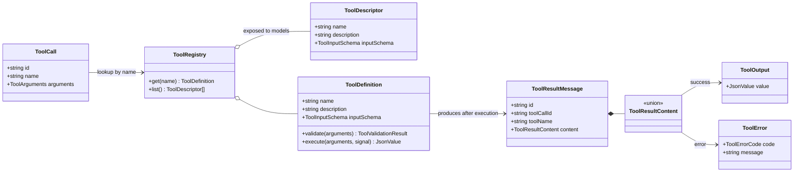

# Tool Registry and Execution Boundary

[English](tool-execution.md) | [简体中文](../../zh-CN/architecture/tool-execution.md)

> Status: Implemented foundation  
> Target: V0.1  
> Last updated: 2026-10-02

## 1. Scope of this change

This stage turns one complete `ToolCall` into a normalized `ToolResultMessage`. It provides tool
registration, argument validation, execution, cancellation, and lifecycle events. It does not schedule
multiple calls from an assistant message or call the model again.

The first version contains no filesystem, shell, or network tools. The in-memory `echo` tool exists only
in tests to verify the execution contract.

## 2. Type relationships



## 3. Why errors are tool results

Unknown tools, invalid arguments, and tool exceptions may all be problems that the model can correct.
They do not terminate the future agent loop directly; they produce error results that can enter message
history:

```ts
type ToolResultContent =
  | { type: "output"; value: JsonValue }
  | {
      type: "error"
      code: "unknown_tool" | "invalid_arguments" | "execution_failed"
      message: string
    }
```

A discriminated union is safer than `content + isError` because it cannot represent contradictory
states such as successful content with `isError: true`. A future provider adapter can translate this
structure into the tool-result format required by a particular provider.

## 4. Validation and execution order

```mermaid
sequenceDiagram
    participant Loop as Future Agent Loop
    participant Executor as executeToolCall
    participant Registry as Tool Registry
    participant Tool

    Loop->>Executor: ToolCall + resultMessageId
    Executor-->>Loop: tool.call.started
    Executor->>Registry: get(name)
    Registry-->>Executor: ToolDefinition
    Executor->>Tool: validate(arguments)
    Executor->>Tool: execute(validatedArguments, signal)
    Tool-->>Executor: JsonValue
    Executor-->>Loop: tool.call.completed
    Executor-->>Loop: ToolResultMessage
```

Validation may return normalized arguments, allowing defaults to be applied safely later. A validation
failure never calls `execute`. Registry creation rejects duplicate tool names so registration order
cannot silently replace an implementation.

Registry `get()` returns a local `ToolDefinition` with execution functions. `list()` returns only a
read-only `ToolDescriptor` made of `name`, `description`, and `inputSchema`. Providers can therefore
declare every available tool without receiving local validation or execution functions.

## 5. JSON and security boundary

Tool results enter events, storage, and model context, so they must actually be JSON serializable. In
addition to TypeScript types, the execution boundary rejects `undefined`, `bigint`, non-finite numbers,
cycles, and non-plain objects at runtime and converts them into `execution_failed` results.

This is not a permission system. Passing argument validation does not mean an operation is approved.
Filesystem and shell tools must still pass through future policy, approval, and Rust Runtime boundaries.

## 6. Lifecycle and cancellation

- `tool.call.started`: processing began;
- `tool.call.completed`: a successful or error tool result was produced;
- `tool.call.cancelled`: an abort prevented a result;
- `tool.call.failed`: infrastructure such as final-result publication failed.

Cancellation rethrows the original reason and does not invent a tool result. If the event consumer is
itself unavailable, failure-terminal publication remains best effort; reliable persistence ultimately
requires a transactional event store.

## 7. Foundation for the next step

The next stage can implement a minimal `runAgentLoop`: call `runModelTurn`, extract tool calls, execute
them sequentially through the registry, append tool-result messages, and start another model turn until
`end_turn` or an explicit limit is reached.
