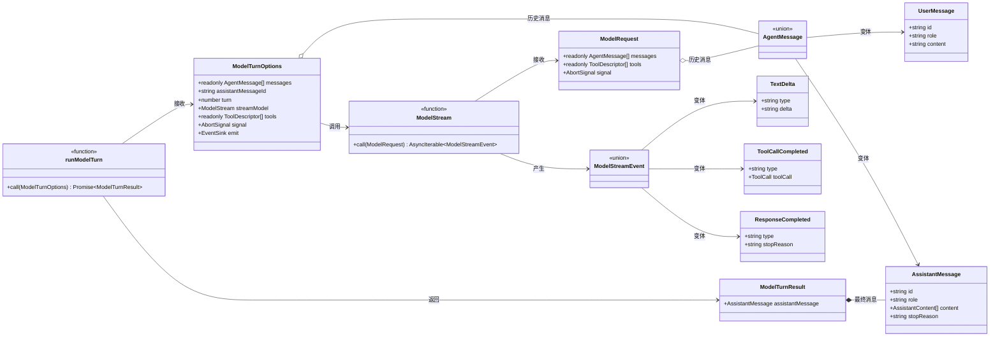

# 最小模型回合设计

[English](../../en/architecture/model-turn.md) | [简体中文](model-turn.md)

> 状态：已实现的基础能力  
> 目标版本：V0.1  
> 最后更新：2026-10-02

## 1. 这次实现解决什么问题

Landache 最终需要的是一个可以反复调用模型、执行工具并把结果送回模型的 Agent Loop。
但第一步只实现其中最小且可独立验证的单元：**一个模型回合**。

一个模型回合负责：

1. 接收不可变的历史消息；
2. 启动一次模型流；
3. 将文本增量转换为结构化事件；
4. 响应取消和事件消费者错误；
5. 只有在模型明确完成后，才生成最终 Assistant Message。

它暂时不负责工具调用、审批、重试、上下文压缩、持久化或决定是否进入下一回合。
这些职责属于未来更外层的 Agent Loop。将两层分开，可以在增加复杂控制流之前先稳定模型流、
消息和事件之间的契约。

## 2. 为什么叫 `runModelTurn`

最初的原型名为 `runAgentLoop`，但内部只调用一次模型，并没有循环。保留这个名字会让调用者
误以为它已经处理工具结果和多回合终止条件。

当前边界因此命名为 `runModelTurn`：

```text
未来的 runAgentLoop
        │
        ├── runModelTurn
        ├── 执行并记录 Tool Calls
        ├── 把 Tool Results 加入消息历史
        └── 根据明确的停止条件继续或结束
```

`turn` 由上层传入，而不是在函数内部硬编码。未来恢复 Session 或在工具执行后继续时，上层
才能维持正确、单调递增的回合编号。

## 3. 消息数据设计

### 3.1 每条消息都有稳定 ID

```ts
type UserMessage = {
  id: string
  role: "user"
  content: string
}

type AssistantMessage = {
  id: string
  role: "assistant"
  content: AssistantContent[]
  stopReason: "end_turn" | "tool_use" | "max_tokens" | "content_filter"
}
```

ID 由调用方创建，因为调用方最终会负责 Session、持久化和幂等性。稳定 ID 让流式 delta、
最终消息、UI Projection 和数据库记录可以指向同一个逻辑对象，而不依赖数组位置或内容比较。

### 3.2 输入历史是只读的

`messages` 使用 `readonly AgentMessage[]`。`runModelTurn` 不修改调用方的历史，只返回本回合
生成的 Assistant Message，由外层显式追加。这避免部分失败时悄悄污染 Session 状态，也让
状态所有权更容易推理。

### 3.3 只允许完整的 Assistant Message

`AssistantMessage.stopReason` 不包含 `null`。流式期间的草稿由函数内部的内容构建器和尚未确定
的 `stopReason` 表示；只有收到 `response.completed` 后才构造 Assistant Message。

`stopReason` 仍属于最终消息，因为它描述模型为什么停止，并将成为外层循环决定“结束、执行工具
还是继续”的输入。`end_turn` 表示正常结束，`tool_use` 表示外层循环需要处理 Tool Call。

### 3.4 `runModelTurn` 数据类型关系



图中的 `signal` 和 `emit` 在 TypeScript 中是可选字段，为了保持图形简洁没有重复标注
`undefined`。`EventSink` 表示 `(event: AgentEvent) => void | Promise<void>`。核心约束是：
`ModelStreamEvent` 只是流的输入协议，只有 `ResponseCompleted` 到达以后，函数才会创建并返回
`AssistantMessage`。

## 4. 流式事件设计

当前事件是：

| 事件 | 最小数据 | 原因 |
| --- | --- | --- |
| `turn.started` | `turn` | 标识一次模型回合开始 |
| `message.started` | `messageId`, `role` | 让消费者建立空的消息 Projection |
| `message.delta` | `messageId`, `delta` | 只传新增内容，避免重复发送完整消息 |
| `tool.call.proposed` | `messageId`, `toolCall` | 发布模型提出的完整、尚未执行的调用 |
| `message.completed` | 最终 `message` | 发布经过验证的完整消息 |
| `message.failed` / `message.cancelled` | `messageId` 与原因 | 结束未完成的消息生命周期 |
| `turn.completed` | `turn`, `messageId` | 结束回合并关联最终消息 |
| `turn.failed` / `turn.cancelled` | `turn` 与原因 | 结束未完成的回合生命周期 |

`message.delta` 不包含不断增长的完整消息。消费者按照 `messageId` 自行累加 delta；服务端内部
按连续文本块使用字符串数组，刷新文本块时只调用一次 `join("")`。这样既避免重复膨胀，又能
保持文本块和 Tool Call 的原始顺序。

本层也不再发出 `agent.started` 和 `agent.completed`。它无法诚实地声明整个 Agent Run 的开始
或完成，这两个事件应由未来真正的 Agent Loop 发出。

## 5. 明确处理模型流事件

Provider 中立的 `ModelStream` 接收一个 `ModelRequest`：对话消息、本回合暴露给模型的 Tool
Descriptor，以及可选的取消信号。`runModelTurn` 默认使用空工具列表，也不会把工具执行函数暴露给
Provider。

模型流事件采用可辨识联合类型，并通过 `switch` 逐个处理：

```ts
type ModelStreamEvent =
  | { type: "text.delta"; delta: string }
  | { type: "tool_call.completed"; toolCall: ToolCall }
  | { type: "response.completed"; stopReason: ModelStopReason }
```

`ModelStopReason` 是模型流自己的类型，不引用 `AssistantMessage`。`runModelTurn` 通过穷举映射把
它转换成领域层的 `AssistantStopReason`。当前同时保留 `max_tokens` 和 `content_filter`，不会把
截断或安全过滤静默伪装为正常的 `end_turn`。

默认分支调用 `assertNever`。当以后加入 Usage 或 Reasoning 事件时，如果没有同步更新
处理逻辑，TypeScript 会在构建阶段失败，而不是在运行时把新事件误认为完成事件。

如果流在 `response.completed` 之前结束，函数抛出错误，不会生成一个看似完整的 Assistant
Message。

## 6. 取消与事件消费者语义

`AbortSignal` 在启动模型前和消费每个流事件时检查：

- 开始前取消时，模型不会被调用；
- 流式过程中取消时，本回合失败，不发布完成消息；
- 同一个 Signal 会传给 Provider Adapter，使其未来可以主动终止网络请求。

`emit` 是一个被 `await` 的 fail-fast 边界。如果事件消费者抛错，本回合立即失败。函数记录哪些
started/terminal 事件已成功发送：普通异常以 `message.failed`、`turn.failed` 收尾，abort 以
`message.cancelled`、`turn.cancelled` 收尾，且不会为尚未开始或已经完成的实体制造矛盾终态。

如果 `emit` 本身已经不可用，终态只能 best-effort 发送，函数保留并重新抛出原始错误。真正的
可靠事件闭合需要未来 Event Store 提供事务或原子追加能力，不能由一次普通回调调用保证。

`ModelTurnResult` 只返回新生成的 `assistantMessage`。消息历史归未来外层 Agent Loop 所有，由
调用方显式追加，避免“返回完整历史”和“返回最后消息”两个事实来源产生分歧。

## 7. 构建和类型检查为什么属于本次设计

Node.js 的 TypeScript type stripping 只删除类型语法，并不证明类型正确。因此：

- `node --test` 只负责运行测试；
- 每个 TypeScript 包都有自己的构建和类型检查脚本；
- 根 `tsconfig.json` 使用 Project References 表达 `agent -> protocol` 依赖；
- 包只从 `dist/` 导出 JavaScript 和声明文件，不把 `src/*.ts` 作为公共入口；
- PR CI 同时运行类型检查、构建和测试。

测试代码也被单独的 `tsconfig.test.json` 检查。这样“测试通过但代码存在类型错误”不能再进入
主分支。

## 8. 如何参考 Pi

本设计参考了 Pi 仓库
[`packages/agent/src/agent-loop.ts`](https://github.com/earendil-works/pi/blob/de7e675de2c909776a2ed6253fe6b8495465167b/packages/agent/src/agent-loop.ts)
在 commit `de7e675de2c909776a2ed6253fe6b8495465167b` 时的实现。

从 Pi 吸收的是结构思想：

- 模型输出通过事件逐步暴露，而不是等待完整字符串；
- 模型回合、工具执行和外层继续条件是不同层次；
- `AbortSignal` 贯穿模型和工具路径；
- Tool Result 会成为后续模型回合的消息；
- 每个重要阶段都有可观察的生命周期事件。

Landache 没有复制 Pi 的实现代码，也没有在第一步引入它已经具备的成熟能力，包括 steering、
follow-up queue、并行或顺序工具执行、动态工具集、上下文转换和截断 Tool Call 恢复。那些功能
依赖更完整的数据模型和真实需求；提前复制只会隐藏我们尚未做出的架构决定。

## 9. 为下一步铺垫什么

这次提交建立的稳定接缝将支持：

1. 在已实现的[最小 `runAgentLoop`](agent-loop.md) 上增加 Run 级能力；
2. 将事件接入持久化存储和 CLI/Web Projection；
3. 在 Provider Adapter 中把不同模型 SDK 映射为统一的 `ModelStreamEvent`；
4. 在 Event Schema 稳定后加入 sequence、run ID、时间戳和版本信息。

Tool Registry、Tool Result 和[最小 `runAgentLoop`](agent-loop.md) 已经实现，共同验证了真正的闭环：
模型提出调用 → 校验并执行工具 → 记录结果 → 再调用模型 → 明确结束。后续可以在这个边界上增加
持久化、策略和 Provider 集成。
