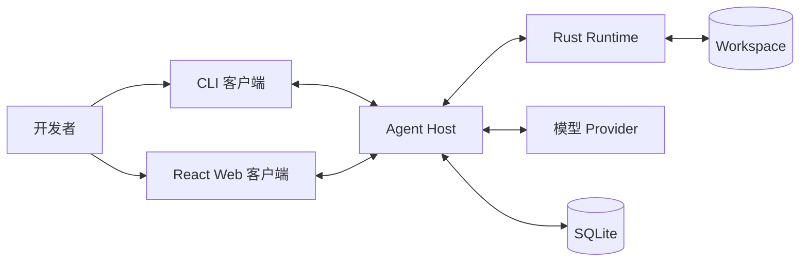
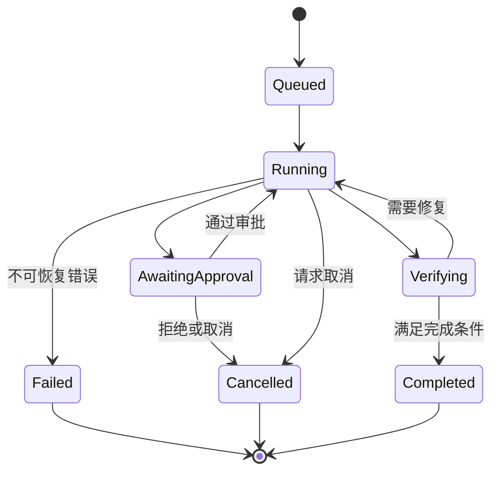

# Landache 技术架构

[English](../../en/architecture/overview.md) | [简体中文](overview.md)

> 状态：提案  
> 目标版本：V0.1  
> 最后更新：2026-10-02

## 1. 文档目的

Landache 是一个开源 Coding Agent。它首先要能用于真实的日常开发，同时保持
可理解、可观察和足够安全，并且适合作为一个长期维护的项目。

本文定义 Landache V0.1 的技术架构提案。它描述系统边界与职责，不规定所有实现
细节。文档中的决定只有落实到代码、得到测试覆盖并且能够在运行时被观察，才算真正
完成。

## 2. 架构目标

Landache 应当做到：

1. CLI 和图形客户端使用同一套 Agent 能力；
2. 客户端刷新、断开或崩溃时，不丢失 Session；
3. 模型请求、工具调用、审批、文件修改和验证过程全部可检查；
4. 将模型输出、仓库内容和工具输出都视为不可信输入；
5. 使用明确且由 Schema 驱动的语言边界；
6. 支持多个模型 Provider，同时保留各 Provider 的独有能力；
7. 核心功能不依赖真实模型或图形界面也能测试；
8. 从本地开发者工具开始演进，V0.1 不引入远程控制平面。

## 3. V0.1 非目标

V0.1 暂不提供：

- 多用户协作；
- 远程执行集群；
- 自主 Multi-Agent 编排；
- 跨 Session 的长期记忆；
- 公共插件市场；
- 完整的操作系统级隔离；
- 移动客户端；
- 无人值守的生产环境部署。

这些能力是被有意识地推迟，而不是被永久否定。V0.1 的设计不应阻止未来演进，
但也不应提前承担这些能力的运维成本。

## 4. 核心原则

### 4.1 后端持有权威状态

CLI 和 Web UI 负责呈现状态，但不拥有 Agent Run 的真实状态。Workspace 身份、
Session、Run 状态、审批、消息、工具调用和 Artifact 由 Agent Host 管理，并独立于
客户端持久化。

浏览器刷新或 CLI 断开不能取消或清除 Run，除非用户明确请求取消。

### 4.2 用事件描述已经发生的事实

每一个有意义的状态变化都表示为结构化、有顺序的事件。客户端消费事件并生成会话、
执行时间线、审批队列和文件变更等投影视图。

Event 表示已经发生的事实，只能追加；Command 表达意图，可以被接受或拒绝。

### 4.3 模型不是可信执行器

模型输出可以请求执行操作，但不能直接执行。每个工具请求必须依次经过 Schema 校验、
策略判断、必要的用户审批、实际执行和结果标准化。

### 4.4 每种语言只承担清晰的职责

- TypeScript 负责产品编排、Agent Loop、Provider 和客户端；
- Rust 负责文件、进程和系统操作的本地执行边界；
- Python 仅用于离线评测与分析，不是运行 V0.1 产品的必要依赖。

### 4.5 跨语言契约必须显式定义

TypeScript、Rust 和 Python 不得各自维护一套手写的共享消息类型。`schemas/` 中的
JSON Schema 是 Command、Event、配置和 Runtime 请求的唯一事实来源。

## 5. 系统上下文



V0.1 默认在本地运行。Agent Host、Runtime、数据存储和 Workspace 都位于开发者的
机器上。这是部署选择，而不是永久的协议限制：客户端通过显式契约通信，因此未来仍可
将 Host 放到远程环境。

## 6. 进程模型

推荐的 V0.1 进程拓扑如下：

```text
Landache CLI 或 Web
        │
        │ Command + Event 订阅
        ▼
TypeScript Agent Host
        │
        ├── 模型 Provider API
        ├── SQLite Session/Event Store
        └── 经过 Schema 校验的本地 IPC
                    │
                    ▼
              Rust Runtime
                    │
                    ├── 文件系统
                    ├── Shell / PTY / 进程
                    └── Git 操作
```

Agent Host 初期可以由 CLI 启动，并在不存在客户端和活跃 Run 时退出。Web 客户端连接
同一个 Host，而不是实现第二套 Agent Loop。

Host 的最终可执行文件名称和生命周期策略仍未决定。开始实现时，需要在 `apps/` 中
增加独立的 Host 应用。

## 7. 组件职责

### 7.1 客户端

客户端负责：

- 收集用户意图；
- 展示消息、计划、事件、Diff、审批和错误；
- 使用幂等键提交 Command；
- 从已知 Event Sequence 位置重新连接；
- 维护纯展示性质的临时状态。

React 客户端采用：

- TanStack Query 管理服务端资源；
- Zustand 仅管理临时 UI 状态；
- React Router 管理可通过 URL 定位的 Workspace 和 Session；
- 独立 Settings 层保存展示偏好。

客户端不能保存一份正在运行的 Agent 的权威副本。

### 7.2 Agent Host

TypeScript Agent Host 是本地 Landache 实例的控制平面，包含：

- Workspace 与 Session Registry；
- Run 协调与取消；
- Agent Loop；
- Context 组装；
- 模型 Provider Gateway；
- Prompt 组合；
- Tool Registry 与 Schema 校验；
- 权限和审批协调；
- Event 发布与 Projection；
- 持久化与恢复；
- 面向客户端的 API。

Host 决定“下一步应该做什么”，但不能绕过 Runtime 执行具有权限影响的 Workspace
操作。

### 7.3 Rust Runtime

Runtime 是一个窄而明确的执行边界，负责：

- 路径规范化和 Workspace 相对路径处理；
- 文件读取与原子写入；
- Patch 应用和回滚原语；
- Shell 与 PTY 进程生命周期；
- Timeout、取消和进程树终止；
- 环境变量过滤；
- 输出限制和流式传输；
- Git Status、Diff 以及其他经过批准的仓库操作；
- 标准化执行错误。

Runtime 决定“经过批准的操作是否可以执行，以及如何执行”，但不调用模型，也不决定
Agent 的下一步行为。

### 7.4 模型 Provider

Provider Adapter 提供公共基线和显式声明的能力：

```text
基线能力：messages、streaming、tool calls、usage
可选能力：reasoning、vision、prompt caching、structured output
```

Agent Host 根据 Provider 能力选择行为。Provider 的独有能力通过类型化的能力检查
暴露，而不是为了统一接口被静默丢弃。

### 7.5 评测系统

基于 Python 的评测系统离线运行，消费稳定 Artifact：

- Fixture；
- Event Trajectory；
- Patch；
- 确定性验证结果；
- Token、成本和延迟摘要。

评测代码不能依赖导入 TypeScript 内部实现，而应通过 Schema 和记录的 Artifact
交互。

## 8. Agent Run 生命周期



简化后的执行循环为：

1. 接受用户 Command；
2. 创建或恢复 Run；
3. 组装有预算限制的 Context；
4. 调用选定模型；
5. 持久化流式输出和模型提出的 Tool Call；
6. 校验每个 Tool Call；
7. 评估权限策略，必要时请求审批；
8. 通过 Runtime 执行；
9. 持久化标准化结果；
10. 根据明确条件继续、验证、失败或完成。

Retry 必须有次数限制并且按错误分类。网络传输失败、Provider 限流、非法模型输出、
工具失败和验证失败是不同的错误类型，不能共享一个无限重试循环。

## 9. Command 与 Event

Command 表达期望进行的变更，例如：

```text
session.create
run.start
run.cancel
approval.resolve
message.submit
```

Event 记录已经被接受的事实，例如：

```text
session.created
run.started
model.output.delta
tool.call.proposed
approval.requested
tool.call.started
tool.call.completed
workspace.patch.created
verification.completed
run.completed
run.failed
```

每个 Event 至少包含：

```text
event_id
schema_version
sequence
timestamp
workspace_id
session_id
run_id
causation_id
correlation_id
payload
```

Sequence 在一个 Session 内单调递增。客户端重连时请求最后确认 Sequence 之后的事件。
可能被重试的 Command 必须携带幂等键。

## 10. 持久化模型

V0.1 使用 WAL 模式的 SQLite 作为本地持久化存储。

计划存储的数据包括：

- Workspace 及其规范身份；
- Session 和 Run；
- 只追加的 Event；
- Message 和查询 Projection；
- 审批决定；
- Artifact 元数据；
- 配置元数据；
- Schema 和 Migration 版本。

较大的工具输出和二进制 Artifact 可以作为内容寻址文件存储，并由 SQLite 保存引用。
Secret 不能写入普通 Session 记录；Provider 凭据应存放在操作系统 Keychain 或明确
配置的外部 Secret Source 中。

Event Log 是恢复记录；查询表是可以重建或迁移的 Projection。V0.1 不承诺跨所有未来
Schema 版本进行任意历史 Replay，但每次破坏性的 Event 变更都必须提供 Migration，
或者定义明确的兼容边界。

## 11. Workspace 身份

Workspace 不等同于客户端当前目录。它包含：

- 稳定的 Landache ID；
- 规范化根路径；
- 可选的 Git Repository 身份；
- 信任与权限状态；
- 项目配置；
- 关联的 Session。

所有跨协议边界传递的路径都使用 Workspace 相对路径。Runtime 在访问前执行规范化，
并拒绝路径穿越或通过 Symlink 逃逸到允许根目录之外。

即使属于同一个 Git Repository，不同 Worktree 也视为不同 Workspace 实例。

## 12. 权限与安全模型

权限决策有三种结果：

```text
allow | ask | deny
```

策略可以匹配：

- Tool 身份；
- 规范化路径与操作；
- 命令可执行文件和参数；
- 网络目标；
- 环境变量或 Secret 访问；
- Workspace 信任级别。

V0.1 的安全规则：

1. 默认拒绝访问允许根目录之外的文件；
2. 破坏性或范围明显过大的操作必须请求审批；
3. 不得把父进程的完整环境传递给子进程；
4. 持久化输出前对已知 Secret 进行脱敏；
5. 限制运行时间、输出大小和并发子进程数量；
6. 每次审批与执行都留下 Audit Event；
7. 将仓库指令和工具输出视为不可信内容；
8. 取消操作必须终止完整的子进程树。

Rust Runtime 是策略执行边界，但不是完整 Sandbox。未来可以增加容器或 VM 隔离，
但文档和 UI 不能宣称超出实际实现能力的安全级别。

## 13. 可观察性

可观察性不仅服务项目开发者，也是产品功能。用户应该能够解释 Run 为什么做出某个
决定，以及失败发生在哪里。

每个 Run 记录：

- 经过脱敏的模型请求与响应；
- Context 组成与 Token 估算；
- Tool 输入、输出、耗时和退出状态；
- 审批；
- 文件 Patch；
- 验证命令与结果；
- Retry 分类；
- Token、成本和延迟；
- Command 与 Event 之间的因果关系。

UI 中的执行时间线是这些记录的 Projection，而不是另一套独立日志系统。

## 14. 失败与恢复

预期失败包括：

- 客户端断开；
- Agent Host 重启；
- Runtime 崩溃；
- 模型 Stream 中断；
- 非法 Tool Call；
- 命令超时；
- 文件只完成部分修改；
- Workspace 状态过期；
- 存储 Migration 失败。

恢复要求：

- 客户端通过 Session 和 Sequence 重连；
- 中断的模型调用进入明确的终止或可恢复状态；
- 文件修改尽可能使用原子写入；
- Tool 完成结果必须在下一次模型调用前持久化；
- Runtime 重启不能伪造成功结果；
- 启动时检查停留在临时状态的 Run；
- Migration 必须是事务性的，并保留可恢复的备份路径。

## 15. 仓库映射

```text
apps/cli                 CLI 客户端
apps/web                 React 客户端
apps/<host>              计划增加的本地 Agent Host 可执行程序

packages/agent           Agent Loop 与 Run 协调
packages/protocol        生成的类型与协议辅助代码
packages/providers       模型 Provider Adapter
packages/config          配置加载与校验
packages/ui              可复用 React 组件

crates/runtime           可信本地执行边界

schemas/commands         Command Schema
schemas/events           Event Schema
schemas/config           配置 Schema

evals                    离线评测
fixtures                 确定性测试仓库
docs                     产品与技术决定
```

依赖方向必须指向契约和核心逻辑：

```text
clients -> host -> agent -> protocol
                    |         ^
                    v         |
                 providers  runtime IPC
```

核心 Package 不能依赖客户端代码；Runtime 不能导入或依赖 TypeScript 产品逻辑。

## 16. 测试策略

架构通过多个层次进行验证：

- 纯 Policy、状态转换和 Context 逻辑的 Unit Test；
- TypeScript 与 Rust 之间的 Schema Contract Test；
- 使用 Fake Model 的确定性 Agent Trajectory Test；
- 在临时 Workspace 中运行的 Runtime Integration Test；
- 在 Event 之间终止组件的恢复测试；
- CLI 和 Web 针对同一个 Agent Host 的端到端测试；
- 路径穿越、Symlink 逃逸、环境泄漏、Timeout 和进程树取消等安全测试；
- 基于 Fixture 的 Patch 与验证结果评测。

需要付费模型的测试必须与默认的确定性测试套件分离。

## 17. 演进路线

### V0.1

- 本地 Agent Host；
- CLI 优先，Web 客户端使用同一 API；
- 一个完整 Provider 实现和一个稳定 Provider Contract；
- 最小化的 Read、Edit、Shell 和 Verification Tool；
- SQLite Session 与有序 Event；
- 显式审批和 Audit Timeline。

### V0.2

- 评估桌面端打包；
- 更强的可选隔离能力；
- Extension API；
- 更丰富的 Context Index；
- 更多 Provider；
- 在真实使用证明有价值后实验远程连接。

### 长期

- IDE 集成；
- 远程与并行 Runner；
- Multi-Agent Workflow；
- 跨 Session Memory；
- 稳定的第三方 Extension 生态。

后续能力必须继续遵守 Command、Event、权限和可观察性原则，不能绕过这些边界。

## 18. 开放决策

现在已有两个 V0.1 初始决定记录在
[Runtime、Provider 与 CLI 纵向切片](runtime-provider-cli.md)中：Runtime IPC 首先采用基于 stdio
的单请求 NDJSON，OpenAI Responses API 是首个参考 Provider。这些选择以后可以在现有接口后演进。

以下问题需要继续讨论或形成独立 ADR：

1. 本地 Agent Host 应当是 Node.js 进程、编译后的 JavaScript 程序，还是最终成为
   Rust 可执行程序的一部分？
2. 客户端传输应使用 HTTP + SSE、WebSocket，还是在统一协议抽象之后提供本地 IPC？
3. 除 `read_file` 外，最小且安全的内置 Tool 集合是什么？
4. 哪些操作可以得到持久授权？
5. Run 的准确完成条件和验证条件是什么？
6. 如何在不破坏调试价值的前提下对 Event Payload 脱敏？
7. 默认保存 Provider Prompt 的哪些部分？
8. 本地 Host 应该叫什么名字，并放在 Monorepo 的什么位置？

这些问题被有意保留为可见状态。没有解决的问题不能被偶然的实现选择隐藏起来。
