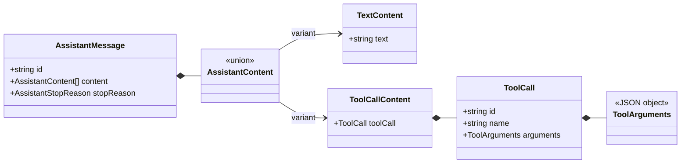

# Tool Call 数据契约

[English](../../en/architecture/tool-call-contract.md) | [简体中文](tool-call-contract.md)

> 状态：已实现的数据契约  
> 目标版本：V0.1  
> 最后更新：2026-10-02

## 1. 本次边界

本次变更只允许模型提出结构化 Tool Call，并将其放入最终 Assistant Message。它不注册工具、
不校验某个工具的业务参数、不执行工具，也不生成 Tool Result。这让“模型输出协议”和“具有副作用
的执行系统”保持分离。

## 2. 核心类型

### 内容使用数组

Assistant Message 的 `content` 从字符串改为可辨识内容块数组。这样可以保留模型生成的真实顺序，
例如“解释文本 → Tool Call → 补充文本”，并为以后增加 reasoning 或图片内容留下明确扩展点。

### 参数必须可序列化

`ToolArguments` 是 JSON Object，而不是 `unknown`。Tool Call 将来需要进入事件、数据库、日志和
跨进程协议；不可序列化的值不能成为协议的一部分。具体工具的参数 Schema 仍由未来 Tool Registry
负责校验。

### ID 与名称职责不同

`name` 用于在 Registry 中查找工具；`id` 标识本次调用，并让未来 Tool Result 精确关联请求。同一
Assistant Message 内的 Tool Call ID 必须唯一，重复 ID 会让结果关联产生歧义，因此当前回合直接拒绝。

## 3. 流与完成语义

Provider Adapter 将供应商特有的参数碎片组装完成后，向核心发送
`tool_call.completed`。核心随后发布 `tool.call.proposed`；“proposed”明确表示它尚未经过 Schema、
权限或执行阶段。

以下不变量由 `runModelTurn` 检查：

- `tool_use` 至少对应一个 Tool Call；
- 存在 Tool Call 时不能用 `end_turn` 结束；
- 一个消息内不能出现重复 Tool Call ID；
- 流必须以 `response.completed` 明确完成。

不变量失败发生在 started 事件之后，因此会用 `message.failed` 和 `turn.failed` 关闭生命周期。
如果是 abort，则使用独立的 cancelled 事件，让投影和审计能够区分失败与用户取消。

模型流使用独立的 `ModelStopReason`，再显式映射为消息的 `AssistantStopReason`。除 `end_turn` 和
`tool_use` 外，`max_tokens` 与 `content_filter` 也会原样保留，不丢失 Provider 的停止语义。

## 4. 为什么暂不流式暴露参数

不同 Provider 的 Tool Call 增量格式差异较大，而且半截 JSON 对核心、UI 和执行器都没有稳定语义。
本阶段让 Adapter 负责拼装，核心只接收完整调用。以后如果 UI 确实需要展示参数生成过程，可以增加
仅用于观察的 delta 事件，而不让不完整参数进入可执行契约。

## 5. 为下一步铺垫

下一步可以新增 Tool Definition、Registry、Schema 校验和 Tool Result Message，然后由真正的
`runAgentLoop` 根据 `tool_use` 执行工具、追加结果并开始下一个模型回合。
