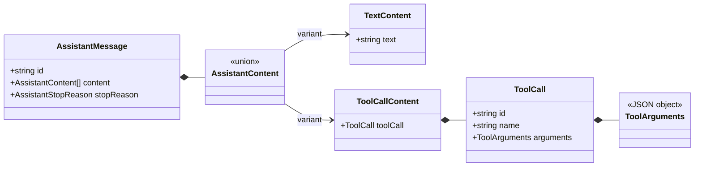

# Tool Call 数据契约

[English](../../en/architecture/tool-call-contract.md) | [简体中文](tool-call-contract.md)

> 状态：已实现的数据契约  
> 目标版本：V0.1  
> 最后更新：2026-10-02

## 1. 本次边界

本次变更只允许模型提出结构化 Tool Call，并将其放入最终 Assistant Message。它不注册工具、
不校验某个工具的业务参数、不执行工具，也不生成 Tool Result。这让“模型输出协议”和“具有副作用
的执行系统”保持分离。

## 2. 核心类型



### 内容使用数组

Assistant Message 的 `content` 从字符串改为可辨识内容块数组。这样可以保留模型生成的真实顺序，
例如“解释文本 → Tool Call → 补充文本”，并为以后增加 reasoning 或图片内容留下明确扩展点。

### 参数必须可序列化

`ToolArguments` 是 JSON Object，而不是 `unknown`。Tool Call 将来需要进入事件、数据库、日志和
跨进程协议；不可序列化的值不能成为协议的一部分。具体工具的参数 Schema 仍由未来 Tool Registry
负责校验。

### ID 与名称职责不同

`name` 用于在 Registry 中查找工具；`id` 标识本次调用，并让未来 Tool Result 精确关联请求。同一
Assistant Message 内的 Tool Call ID 必须唯一，重复 ID 会让结果关联产生歧义，因此当前回合直接拒绝。

## 3. 内容块拼装

`runModelTurn` 并不是把每个 delta 当作一个成品块，而是从流中拼出有序的 `content` 数组。文本以
`text.delta` 增量到达，完整 Tool Call 以 `tool_call.completed` 到达，二者之间用两块草稿状态衔接：

```ts
const content: AssistantContent[] = []   // 已完成的块，按模型顺序
const pendingTextChunks: string[] = []   // 尚未 flush 的文本 delta
```

文本 delta 先累积进 `pendingTextChunks`，不会直接写入 `content`。缓冲区只在两个边界被 flush：

1. 每个 Tool Call 到达时，先 flush，再追加 tool-call 块；
2. 流结束后，flush 收尾最后一段文本。

flush 会把积攒的 delta 合并成一个 `text` 块并清空缓冲区。这样每段连续文本对应一个块、文本与
Tool Call 的顺序被保留，而且永远不会产生空文本块。

### 具体示例

某回合先读文件、再用两条连续命令确认测试基线、最后编辑文件，收到的流如下：

```text
text.delta          "我先"                    (1)
text.delta          "读一下 README"           (2)
tool_call.completed read_file        (c1)     (3)
text.delta          "发现一个 typo，顺便"     (4)
text.delta          "确认下测试基线"          (5)
tool_call.completed run_command      (c2)     (6)
tool_call.completed run_command      (c3)     (7)
text.delta          "基线没问题，现在"        (8)
text.delta          "动手改 README"           (9)
tool_call.completed edit_file        (c4)     (10)
text.delta          "改完了"                  (11)
response.completed  (tool_use)                (12)
```

| 步骤 | 事件 | `pendingTextChunks` | `content` |
| --- | --- | --- | --- |
| 1 | `text.delta "我先"` | `["我先"]` | `[]` |
| 2 | `text.delta "读一下 README"` | `["我先","读一下 README"]` | `[]` |
| 3 | `tool_call.completed` c1 | flush → `[]` | `[text "我先读一下 README", tool c1]` |
| 4 | `text.delta "发现一个 typo，顺便"` | `["发现一个 typo，顺便"]` | 不变 |
| 5 | `text.delta "确认下测试基线"` | `["发现一个 typo，顺便","确认下测试基线"]` | 不变 |
| 6 | `tool_call.completed` c2 | flush → `[]` | `[text, tool c1, text "发现一个 typo，顺便确认下测试基线", tool c2]` |
| 7 | `tool_call.completed` c3 | flush → `[]`（空转） | `[text, tool c1, text, tool c2, tool c3]` |
| 8 | `text.delta "基线没问题，现在"` | `["基线没问题，现在"]` | 不变 |
| 9 | `text.delta "动手改 README"` | `["基线没问题，现在","动手改 README"]` | 不变 |
| 10 | `tool_call.completed` c4 | flush → `[]` | `[text, tool c1, text, tool c2, tool c3, text "基线没问题，现在动手改 README", tool c4]` |
| 11 | `text.delta "改完了"` | `["改完了"]` | 不变 |
| 12 | `response.completed` | 不变 | 不变 |
| 收尾 | 最后一次 flush | → `[]` | `[..., text "改完了"]` |

最终 `content` 为：

```ts
content = [
  { type: "text",      text: "我先读一下 README" },
  { type: "tool_call", toolCall: c1 },   // read_file
  { type: "text",      text: "发现一个 typo，顺便确认下测试基线" },
  { type: "tool_call", toolCall: c2 },   // run_command
  { type: "tool_call", toolCall: c3 },   // run_command
  { type: "text",      text: "基线没问题，现在动手改 README" },
  { type: "tool_call", toolCall: c4 },   // edit_file
  { type: "text",      text: "改完了" },
]
```

有两个容易写错的细节值得强调：

- 第 6-7 步是连续的两个 Tool Call，c3 之前的 flush 发现缓冲区为空，什么都不推，因此 c2 和 c3
  之间不会出现空文本块；
- 第 1-2 步的 delta 属于同一段连续文本，最终合并成一个块，而不是每个 delta 一个块；第 11 步
  开始的文本后面没有 Tool Call 触发 flush，所以必须靠流结束后的最后一次 flush 收尾。

## 4. 流与完成语义

Provider Adapter 将供应商特有的参数碎片组装完成后，向核心发送
`tool_call.completed`。核心随后发布 `tool.call.proposed`；“proposed”明确表示它尚未经过 Schema、
权限或执行阶段。

以下不变量由 `runModelTurn` 检查：

- `tool_use` 至少对应一个 Tool Call；
- 存在 Tool Call 时不能用 `end_turn` 结束；
- 一个消息内不能出现重复 Tool Call ID；
- 流必须以 `response.completed` 明确完成。

不变量失败发生在 started 事件之后，因此会用 `message.failed` 和 `turn.failed` 关闭生命周期。
如果是 abort，则使用独立的 cancelled 事件，让投影和审计能够区分失败与用户取消。

模型流使用独立的 `ModelStopReason`，再显式映射为消息的 `AssistantStopReason`。除 `end_turn` 和
`tool_use` 外，`max_tokens` 与 `content_filter` 也会原样保留，不丢失 Provider 的停止语义。

## 5. 为什么暂不流式暴露参数

不同 Provider 的 Tool Call 增量格式差异较大，而且半截 JSON 对核心、UI 和执行器都没有稳定语义。
本阶段让 Adapter 负责拼装，核心只接收完整调用。以后如果 UI 确实需要展示参数生成过程，可以增加
仅用于观察的 delta 事件，而不让不完整参数进入可执行契约。

## 6. 为下一步铺垫

Tool Definition、Registry、参数校验和 Tool Result Message 已在
[Tool Registry 与执行边界](tool-execution.md) 中实现。接下来由真正的 `runAgentLoop` 根据
`tool_use` 执行工具、追加结果并开始下一个模型回合。
