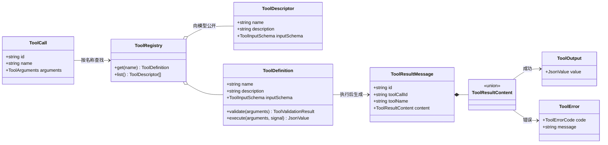

# Tool Registry 与执行边界

[English](../../en/architecture/tool-execution.md) | [简体中文](tool-execution.md)

> 状态：已实现的基础能力  
> 目标版本：V0.1  
> 最后更新：2026-10-02

## 1. 本次边界

本阶段把完整 `ToolCall` 转换为标准化 `ToolResultMessage`。它提供工具注册、参数校验、执行、
取消和生命周期事件，但不负责从 Assistant Message 中调度多个调用，也不再次调用模型。

第一版没有文件、Shell 或网络工具。测试中的 `echo` 是内存工具，只用于验证执行契约。

## 2. 类型关系



## 3. 为什么错误也是 Tool Result

未知工具、参数错误和工具自身异常都可能是模型可以纠正的问题，因此它们不会直接破坏未来的
Agent Loop，而是生成可加入消息历史的错误结果：

```ts
type ToolResultContent =
  | { type: "output"; value: JsonValue }
  | {
      type: "error"
      code: "unknown_tool" | "invalid_arguments" | "execution_failed"
      message: string
    }
```

可辨识联合比 `content + isError` 更安全，因为它不能表达“成功内容但 `isError: true`”之类的
矛盾状态。未来 Provider Adapter 可以把它转换成供应商需要的 Tool Result 格式。

## 4. 校验与执行顺序

```mermaid
sequenceDiagram
    participant Loop as Future Agent Loop
    participant Executor as executeToolCall
    participant Registry as Tool Registry
    participant Tool

    Loop->>Executor: ToolCall + resultMessageId
    Executor-->>Loop: tool.call.started
    Executor->>Registry: get(name)
    Registry-->>Executor: ToolDefinition
    Executor->>Tool: validate(arguments)
    Executor->>Tool: execute(validatedArguments, signal)
    Tool-->>Executor: JsonValue
    Executor-->>Loop: tool.call.completed
    Executor-->>Loop: ToolResultMessage
```

校验可以返回规范化后的参数，因此未来可以安全应用默认值。校验失败时不会调用 `execute`。
Registry 在创建时拒绝重复工具名，避免注册顺序静默覆盖另一个实现。

Registry 的 `get()` 返回带执行函数的本地 `ToolDefinition`；`list()` 只返回由 `name`、
`description` 和 `inputSchema` 组成的只读 `ToolDescriptor`。这样 Provider 可以声明全部工具，
但不会接触本地的校验与执行函数。

## 5. JSON 与安全边界

Tool Result 将进入事件、存储和模型上下文，必须真正可 JSON 序列化。除了 TypeScript 类型，执行
边界还会在运行时拒绝 `undefined`、`bigint`、非有限数字、循环引用和非普通对象，并将其转换成
`execution_failed` 结果。

这不是权限系统。参数通过 Schema 也不代表操作已获批准；文件和 Shell 工具仍必须经过未来的
Policy、Approval 和 Rust Runtime 边界。

## 6. 生命周期与取消

- `tool.call.started`：开始处理调用；
- `tool.call.completed`：产生了成功或错误 Tool Result；
- `tool.call.cancelled`：Abort 导致没有结果；
- `tool.call.failed`：执行框架无法可靠发布最终结果等基础设施失败。

取消会重新抛出原始原因，不会伪造 Tool Result。事件消费者失败时，失败终态仍然只能 best-effort
发布；可靠持久化最终需要事务性 Event Store。

## 7. 接入 Agent Loop

[最小 Agent Loop](agent-loop.md) 现已调用 `runModelTurn`、提取 Tool Call、通过 Registry 顺序执行、
把 Tool Result Message 追加到历史，并开始下一模型回合，直到收到非工具停止原因或达到明确上限。
